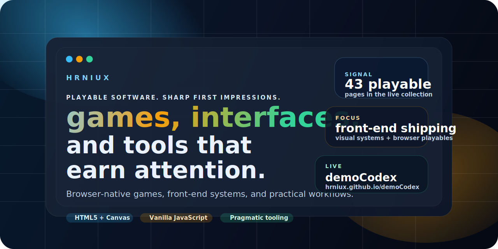
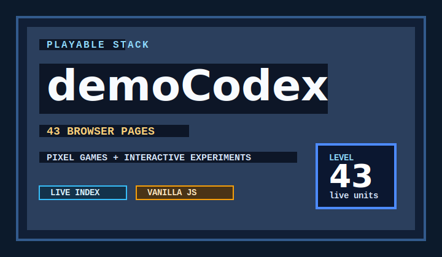
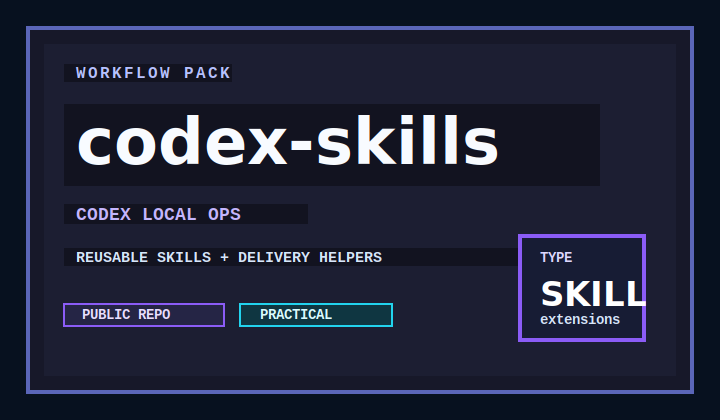
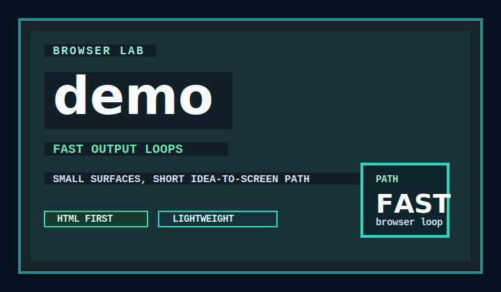
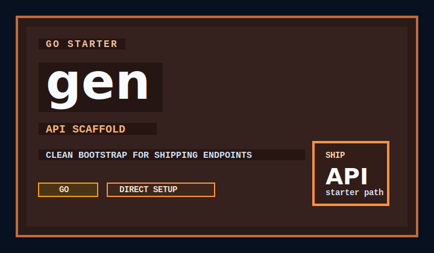

  

  <h1>hrniux</h1>
  

    <strong>Pixel-shaped launch surfaces for browser-native games, front-end craft, and pragmatic tooling.</strong>
  

  

    I build things that open fast, look deliberate, and stay readable when you inspect the source:
    playable browser experiences, interactive product surfaces, and workflow tools that reduce friction.
  

  

    
    
    
    
  

  

    <a href="#launchpad">Launchpad</a> ·
    <a href="#signature-wall">Signature Wall</a> ·
    <a href="#why-it-lands">Why It Lands</a> ·
    <a href="#current-direction">Current Direction</a>
  

## Launchpad

<table>
  <tr>
    <td width="50%" valign="top">
      <h3>What Ships</h3>
      

        Browser-first work that makes sense at first glance and still feels clean under inspection.
        The shared rule is simple: fast entry, strong silhouette, and source that invites reuse.
      

      <ul>
        <li>Browser-native mini games with tight loops and direct replay value</li>
        <li>Interactive front-end surfaces with a deliberate visual identity</li>
        <li>Workflow tooling that helps locally instead of adding ceremony</li>
        <li>GitHub packaging that treats README, About, Pages, and previews as one launch surface</li>
      </ul>
    </td>
    <td width="50%" valign="top">
      <h3>Open First</h3>
      <ul>
        <li><a href="https://hrniux.github.io/demoCodex/">Live DemoCodex</a> for the strongest public showcase</li>
        <li><a href="https://github.com/hrniux/demoCodex">demoCodex</a> for playable pages, browser tests, and packaging work</li>
        <li><a href="https://github.com/hrniux/codex-skills">codex-skills</a> for reusable Codex workflow extensions</li>
        <li><a href="https://github.com/hrniux/demo">demo</a> for fast browser-first iteration</li>
      </ul>
    </td>
  </tr>
</table>

> If a repository is worth opening, it should already feel intentional before the first scroll.

## Signature Wall

<table>
  <tr>
    <td width="50%" valign="top">
      
    </td>
    <td width="50%" valign="top">
      
    </td>
  </tr>
  <tr>
    <td width="50%" valign="top">
      
    </td>
    <td width="50%" valign="top">
      
    </td>
  </tr>
</table>

Each card is wired to a repo I expect people to open immediately, not just skim and leave.

## Why It Lands

<table>
  <tr>
    <td width="33%" valign="top">
      <h3>Fast Hook</h3>
      
<strong>Open it and it runs.</strong>

      
Most surfaces pay off quickly instead of asking for setup, context, or patience.

    </td>
    <td width="33%" valign="top">
      <h3>Visual Direction</h3>
      
<strong>Packaging is part of the work.</strong>

      
The README, About, hero art, Pages site, and repo descriptions all tell the same story.

    </td>
    <td width="33%" valign="top">
      <h3>Fork Value</h3>
      
<strong>Readable under the hood.</strong>

      
The code stays simple enough to study, remix, and actually reuse.

    </td>
  </tr>
</table>

## GitHub Snapshot

  
  

## Current Direction

- turning GitHub surfaces into product launches instead of plain repo pages
- shipping browser-native experiences with stronger replay and stronger packaging
- keeping the source clean while the presentation gets more memorable
- building things people want to click before they want to audit

## Live Surface

- Main live experience: [hrniux.github.io/demoCodex](https://hrniux.github.io/demoCodex/)
- Main source repo: [github.com/hrniux/demoCodex](https://github.com/hrniux/demoCodex)
- Codex workflow extensions: [github.com/hrniux/codex-skills](https://github.com/hrniux/codex-skills)
