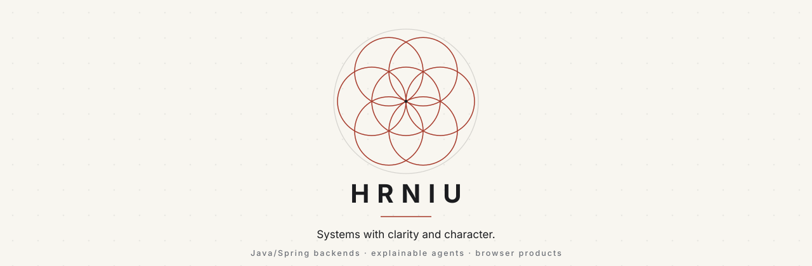
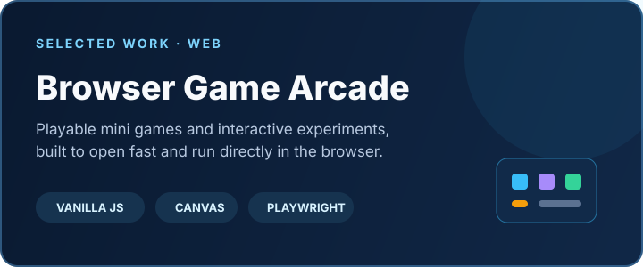
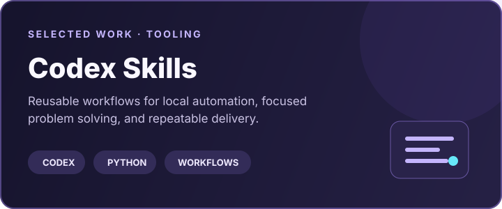
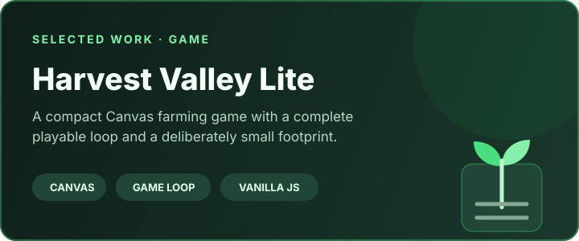

  

  <h1>Hi, I'm hrniu. / 你好，我是 hrniu。</h1>
  

    <strong>I build explainable agent systems, browser-native products, and practical developer tooling.</strong> 
    <strong>我专注于可解释智能体系统、浏览器原生产品与实用开发工具。</strong>
  

  

    My work spans Java and Spring AI backends, vanilla JavaScript experiences, and reusable Codex workflows.
    I care about clear architecture, fast local setup, and software that stays easy to understand after the first impression.
     
    我的工作覆盖 Java 与 Spring AI 后端、原生 JavaScript 交互体验，以及可复用的 Codex 工作流；
    重视清晰架构、快速本地启动和长期可维护性。
  

  

    <a href="https://hrniux.github.io/browser-game-arcade/"><strong>Play the browser arcade / 在线体验</strong></a>
    &nbsp;·&nbsp;
    <a href="https://github.com/hrniux?tab=repositories"><strong>Browse all repositories / 浏览项目</strong></a>
    &nbsp;·&nbsp;
    <a href="https://github.com/hrniux/codex-skills"><strong>Explore Codex skills / 查看技能库</strong></a>
  

  

    <a href="#selected-work--精选项目">Selected work / 精选项目</a> ·
    <a href="#capabilities--专业能力">Capabilities / 专业能力</a> ·
    <a href="#working-principles--工作原则">Working principles / 工作原则</a> ·
    <a href="#current-focus--当前方向">Current focus / 当前方向</a>
  

## Selected work · 精选项目

<table>
  <tr>
    <td width="50%" valign="top">
      
      

        <strong>Browser Game Arcade</strong> 
        A curated collection of browser-native mini games and interactive experiments with no build step required.
         
        无需构建即可运行的浏览器原生小游戏与互动实验合集。
      

      

        <a href="https://hrniux.github.io/browser-game-arcade/"><strong>Play live / 在线体验</strong></a>
        ·
        <a href="https://github.com/hrniux/browser-game-arcade"><strong>View source / 查看源码</strong></a>
      

    </td>
    <td width="50%" valign="top">
      
      

        <strong>Insurance Underwriting Agent</strong> 
        An explainable Java agent with RAG, deterministic rules, MCP tools, decision replay, and auditable execution traces.
         
        以 RAG、确定性规则、MCP 工具、决策重演和审计轨迹构成的可解释 Java 智能体。
      

      

        <a href="https://github.com/hrniux/insurance-underwriting-agent"><strong>Explore the architecture / 查看架构</strong></a>
      

    </td>
  </tr>
  <tr>
    <td width="50%" valign="top">
      
      

        <strong>Codex Skills</strong> 
        Reusable workflow extensions for local automation, focused problem solving, and repeatable delivery.
         
        面向本地自动化、聚焦式问题解决和可重复交付的工作流扩展。
      

      

        <a href="https://github.com/hrniux/codex-skills"><strong>Browse the skills / 查看技能</strong></a>
      

    </td>
    <td width="50%" valign="top">
      
      

        <strong>Harvest Valley Lite</strong> 
        A compact Canvas farming game with a complete playable loop and a deliberately lightweight implementation.
         
        基于 Canvas 的轻量农场游戏，具备完整可玩的核心循环。
      

      

        <a href="https://github.com/hrniux/harvest-valley-lite"><strong>View source / 查看源码</strong></a>
      

    </td>
  </tr>
</table>

## Capabilities · 专业能力

<table>
  <tr>
    <td width="33%" valign="top">
      <h3>Agent systems 智能体系统</h3>
      

        Java 21, Spring Boot, Spring AI, RAG, MCP, deterministic rules, async workflows,
        observability, replay, and auditability.
          
        覆盖可解释智能体的检索、规则、异步编排、可观测性、重演与审计。
      

    </td>
    <td width="33%" valign="top">
      <h3>Browser products 浏览器产品</h3>
      

        Vanilla JavaScript, Canvas, accessible interfaces, responsive layouts,
        browser automation, and fast feedback loops.
          
        构建无需复杂工程配置、兼顾可访问性和响应式体验的浏览器产品。
      

    </td>
    <td width="33%" valign="top">
      <h3>Developer tooling 开发者工具</h3>
      

        Codex workflows, Git and GitHub automation, testable local tooling,
        documentation systems, and pragmatic delivery pipelines.
          
        沉淀可测试、可复用的 Codex、Git/GitHub 自动化与交付工具。
      

    </td>
  </tr>
</table>

## Working principles · 工作原则

- **Make the system legible.** Important decisions should be traceable in the architecture, the runtime, and the documentation. 
  **让系统可读。** 关键决策应能从架构、运行过程和文档中被追踪。
- **Keep the first run simple.** Useful local defaults and clear setup paths matter more than unnecessary infrastructure. 
  **让首次运行简单。** 优先提供实用的本地默认配置和清晰启动路径。
- **Design for inspection.** Code should remain readable, testable, and easy to extend after the polished surface draws people in. 
  **为审查而设计。** 视觉吸引人之后，代码仍应清晰、可测试、易扩展。
- **Treat presentation as delivery.** The README, project metadata, live experience, and source should tell one coherent story. 
  **把呈现视为交付。** README、项目元数据、在线体验与源码应讲述同一个故事。

## Current focus · 当前方向

- Advancing explainable agent workflows with stronger evaluation, replay, and governance. 
  推进具备更强评估、重演与治理能力的可解释智能体工作流。
- Building browser-native interaction systems with memorable mechanics and minimal setup. 
  构建机制鲜明、启动简单的浏览器原生交互系统。
- Packaging repeatable Codex workflows for practical local development. 
  将可重复的 Codex 工作流沉淀为实用的本地开发能力。
- Turning prototypes into portfolio-quality projects with clear architecture and verification. 
  通过清晰架构与可靠验证，将原型打磨为作品集级项目。

  
    Build the useful thing. Explain it clearly. Leave it easier to extend. 
    构建真正有用的产品，清楚解释它，并让后来者更容易扩展。
  

